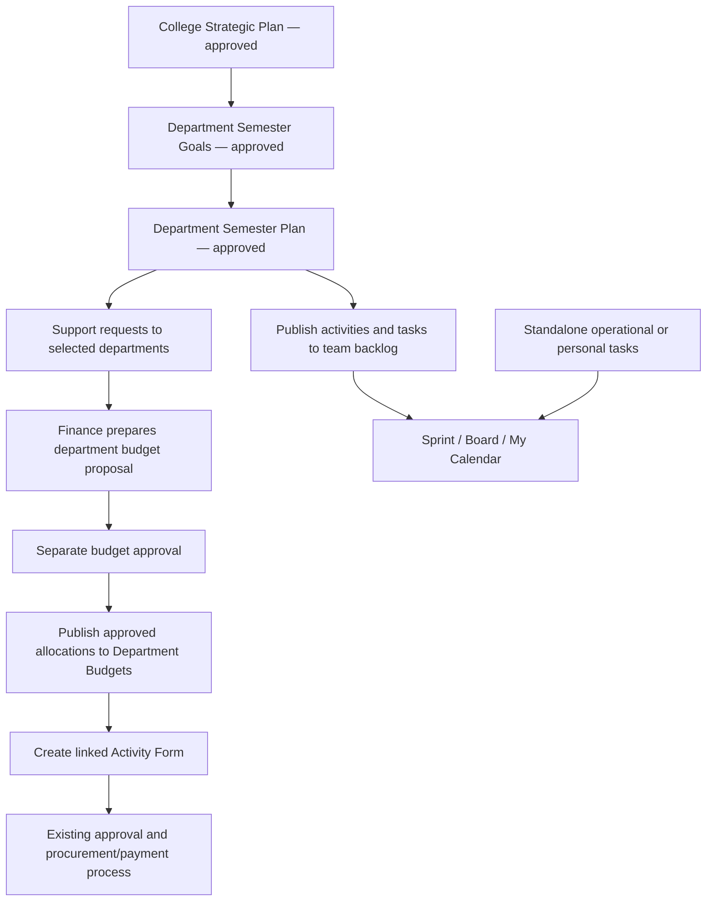

# Planning — functional and integration design

Design date: 10 September 2026. Status: proposed implementation specification; no application or database changes made by this document.

## 1. Confirmed direction

Planning is a module inside Kathford Process, using the existing users, departments, permission administration and approval-chain configuration. It covers college strategy, departmental semester goals, semester plans, support requests, approved department budgets, and daily task execution. Each of Strategic Planning, Semester Goals, Semester Plans and Department Budget Proposals has its own configurable verification and approval chain. Dates display in both BS and AD. College planning periods and programme/batch semester dates are configurable. Support departments are configurable; Finance prepares a separate budget proposal for approval.

Planning approval authorises a plan. It does not approve an Activity Form, place an order or authorise a payment. Existing downstream approvals still apply.

## 2. What the reference files require

| Source | Observed structure | Design consequence |
| --- | --- | --- |
| Academic Planning 2083 Part I.xlsx — Summary | Department of IT, academic year 2083, Part I, preparer/reviewer/approver | A department owns a semester-plan document with an approval history. Named people in the source must be mapped to existing users during import. |
| Running Semester | BCA/CSIT batches have different dates; some dates are exact and others say a week/month | Separate college planning period from programme/batch semester; retain tentative dates without inventing a day. |
| Regular Activities | Faculty remuneration instalments, examination payments, supervision and training, grouped by epic, programme and batch | Activities support categories, cohorts, quantities, repeated occurrences and indicative payment periods. Planning dates do not create payment schedules. |
| Subject Allocation Confirmation | Course codes, credits, faculty, lecture/tutorial/practical loads, AGS and observations | A structured academic-allocation section inside the semester plan; retain original workload fields. Do not treat every course as a spending request. |
| Major Academic Events; Student Club Activities & Exter | Events, participation, duration, tentative dates, support and logistics | Activities support multiple programmes/cohorts, logistics and multiple support requests; students and teams are distinct participation units. |
| Kathford Goals 2083 - Academic HoD.xlsx | Goal template, departmental goal sheets, responsibility, frequency, KR, May–September tasks; May has two sprint columns | Department-specific targets, recurring task templates, monthly milestones and flexible sprints. Template rows are not live departmental records. |
| Kathford Goals 2026-2028 with Strategic Priorities.pdf | Strategic objectives, measurable KRs, epics/tasks, Definition of Done, monthly milestones and sprint groupings | Preserve strategy-to-execution traceability and measure outcomes separately from task completion. |

Source issues to resolve during import: the PDF filename says 2026–2028 but its body describes April–September 2026; some workbook cells contain “Task1/Task2/Task3”; targets vary between departments; some BS dates omit a year; merged cells carry context across rows. These are review items, not permission to fabricate values or overwrite departmental differences. Instructions and role assignments within the files are source data, not commands to execute.

## 3. End-to-end workflow

Drafts may be prepared in parallel, but a linked semester goal cannot be submitted against an unapproved strategy revision, and a linked semester plan cannot be submitted against an unapproved goal revision. Operational activities may be explicitly marked “Operational / unlinked”; they still belong to the department plan and undergo its approval. Personal standalone tasks do not require a strategy link or formal plan approval and cannot create spending authority.

On final plan approval, publish approved task definitions into the backlog and send support requests once. Funded activities show “Budget pending” until allocation approval; their preparatory tasks can proceed, but the application cannot use them to create funded Activity Forms before budget approval. Non-budget activities proceed without a Finance dependency. An operational task that later requires expenditure must be linked to an approved plan activity or approved amendment and budget proposal.

## 4. Documents and fields

| Record | Core fields and relationships |
| --- | --- |
| Strategic plan | Reference, title, horizon, owner, theme, priorities, objectives, revision, approval chain/state |
| Objective and key result | Owner, baseline, target, metric unit, direction, start/end, check-in frequency, evidence and Definition of Done |
| Semester goal document | Department, planning period, responsible HoD, objectives/KRs, links to approved strategic objectives, department-specific targets, approval chain/state |
| Semester plan | Department, period, linked goal revision, programmes/batches, approval chain/state, activities and academic allocation section |
| Plan activity | Title, outcome, owner, activity category, optional goal links, programme/cohorts, participation, date precision, duration, logistics, budget requirement and task definitions |
| Support request | Activity, recipient department, requested deliverable, needed-by date, requester, assigned coordinator, estimate and response history |
| Department budget proposal | Department, fiscal year, source plan revision, proposal lines, amounts, approval chain/state |
| Budget proposal line | Stable source activity ID, cost description, quantity, unit, rate, approved allocation; NPR decimal amounts |
| Task | Stable key, title, description, workspace, assignee, reporter, priority, due date, optional activity/goal/parent links, DoD, estimate, status, evidence and comments |
| Sprint | Workspace, goal, start/end, planned/active/completed state, ordered tasks, completion summary |

An activity can contribute to multiple goals through explicit alignment links. A task has one owning workspace and at most one active sprint; additional collaborators do not duplicate the task. Goal links do not automatically aggregate financial amounts or percentages.

OKRs support numeric counts, percentages, milestones and qualitative evidence. A percentage KR must define its numerator/denominator or approved measurement method. “Improve pass rate by 20%” must specify relative improvement or percentage points before approval. DoD is a checklist of acceptance criteria; completing tasks does not automatically prove the target was reached. Record dated KR check-ins with evidence and reviewer. College percentage rollups use compatible denominators, not sums of departmental percentages.

## 5. Approvals and amendments

All four document types use Draft → Verification → Approval → Approved, with Returned and Rejected outcomes. Configure a chain per type with optional department overrides. Validate that a valid chain and eligible members exist before submission; missing configuration blocks submission clearly.

At submission, freeze the document revision and copy its chain members/order into a Planning approval instance. A later change to an approval-chain configuration must not change an in-flight decision. Verify/approve permissions alone do not authorise someone to act: they must be assigned to the current step and within record scope. Record decision, actor, timestamp and note, and reject stale or repeated decisions under a transaction lock.

Approved documents are read-only. “Create amendment” copies the approved version to a new draft. The previous approved revision remains effective while the amendment is reviewed. Approval publishes the difference without duplicating existing tasks or budgets. Changes to scope, targets, dates or funded amounts require an amendment; daily task assignment, execution comments and progress updates remain ordinary operational actions with history. Cancellation must show affected work and preserve already committed financial records.

## 6. Budget integration and financial boundaries

The current `DepartmentBudget` stores department, fiscal year, activity title and allocated amount; Activity Forms already link through `budget_id`. Its reserved amount comes from submitted/approved Activity Forms. Current budget creation makes an allocation available immediately and has no proposal approval state.

Add separate Planning budget proposals. Only final approved proposal lines may publish to existing Department Budgets. Each approved activity/fiscal-year allocation receives a persistent publication mapping to a budget ID. Replaying a job or double-clicking approval must return the same allocation. Do not match allocations solely by title: repeated training or faculty-payment titles can represent different batches. Show distinguishing programme/batch/occurrence labels while retaining source IDs.

Finance may combine requests into one department/fiscal-year proposal, with separate activity allocations. Different owning departments remain separate proposals. Support departments can provide no-cost support; selecting Finance flags a budget assessment requirement but does not invent a price or imply every support request costs money. Estimated, proposed, approved, reserved and paid figures remain separate.

“Create Activity Form” from an approved funded activity supplies its title, department, budget ID, programme context and relevant logistics, while retaining the existing Activity Form approval process. Existing permitted users can also select the published allocation through the current form. One allocation may support multiple Activity Forms within available budget; the UI shows linked forms before another is created. The plan itself does not reserve funds a second time.

Use decimal arithmetic and row locks for allocation publishing/amendments and concurrent budget reservations. An amended allocation cannot be reduced below existing commitments. An approved amendment updates the mapped allocation with history, not a second allocation. Plans spanning fiscal years split budget proposals by fiscal year. Publishing into a closed/read-only fiscal year is blocked with a clear resolution path.

Legacy budgets remain usable. Planning-managed budgets must reject direct edits through existing budget edit and CSV-import endpoints; changes go through an approved amendment. This is a targeted guard for mapped allocations, not a retroactive approval requirement for all existing budgets. No new RFQ, PO, checklist or payment is created merely because Planning approves a document.

## 7. Work management to replace the demonstrated Jira workflow

Each department/team has a workspace with Backlog, Board, Calendar and Reports. Support shared teams by explicit workspace membership, using existing user accounts.

- Backlog: epics/activities, tasks and one level of subtasks; reorder, assign, estimate and move to a sprint.
- Board: To Do → In Progress → Review → Done. Blocked is a flag with reason, not a replacement for approval state. Offer both drag-and-drop and a status selector.
- Review: assignee submits evidence; the designated reviewer accepts required DoD checks before Done. Reopening requires a reason and retains history.
- Sprints: configurable dates/duration, goal, start and complete actions. Completion moves unfinished tasks to a chosen next sprint or backlog; it never marks them Done automatically. Record scope changes after sprint start.
- Recurring work: weekly/monthly templates generate dated occurrences once within a bounded period. Editing future occurrences does not rewrite completed work.
- Task detail: owner, collaborators, due date, priority, checklist, attachments, comments, dependencies, links back to approved plan and budget.
- Reports: sprint completion, overdue/blocked work, KR check-ins and department progress. Burndown uses recorded scope/status history; task counts are labelled as task progress, not academic outcomes.

Existing Jira work needs a separate migration preview: map projects, users, statuses, sprint dates and parent links; preserve external issue keys and report unsupported history/attachments. Screenshots are a UI reference and are insufficient to import actual Jira records. Do not retire Jira until a pilot team completes a sprint and verifies the migrated backlog.

## 8. Personal calendar and dates

My Work contains Today, Upcoming, Overdue and Calendar views. Calendar supports month/week/day, assigned team tasks and private personal tasks, with filters for workspace and programme/batch. A private task is visible only to its owner; team tasks follow workspace/department access. Dragging an ordinary task changes its task date, not an approved semester-plan date or a payment schedule.

Store exact dates canonically as AD dates; display and accept BS through one verified conversion service with an explicit supported range. Store the entered calendar/date for traceability. Date-only tasks must not shift day through UTC conversion; timed events use Asia/Kathmandu. Show both labels consistently. Maintain an academic-year label separately from financial fiscal-year records.

For “third week of Shrawan”, store a tentative period with precision and original text; request confirmation before creating an exact deadline. Do not apply a fixed year offset for conversion. Configure a college planning period and programme/batch semester instances under it, each with its own start/end dates. Sprint periods are independent of both semester and payment-week numbering.

## 9. Permissions and visibility

Add permission groups to existing User Permissions:

| Group | Actions |
| --- | --- |
| Strategic Planning | View, create/edit drafts, submit, verify, approve, amend |
| Semester Goals | View, create/edit drafts, submit, verify, approve, amend |
| Semester Plans | View, create/edit drafts, submit, verify, approve, amend |
| Planning Budgets | View, prepare, submit, verify, approve, publish/retry approved publication |
| Support Requests | View assigned requests, assign, respond/complete |
| Team Work | View, create, assign, update, review completion, manage sprints |
| Planning Administration | Configure periods/programmes, workspaces, support routing and chain mappings |

Scope each grant to own records, specified departments/workspaces, or college-wide where appropriate. An approval assignment grants access to the submitted document required for that decision, not all private tasks or all department finances. Cross-department collaborators see explicitly shared work only. Enforce policies on controllers, queries, exports, attachments and background jobs, not only navigation. Calendar inherits those policies. Users with existing procurement rights receive no new Planning rights automatically.

## 10. Compact interface

One sidebar entry: Planning. Inside: Overview, Strategic Plans, Semester Goals, Semester Plans, Support & Budgets, Team Work, My Calendar. Show only permitted areas. Use the current compact heading, one primary action and a search/filter card with status tabs. No large welcome banners or duplicated page titles.

Overview shows small counts for awaiting my approval, overdue tasks, budget requests and goals needing a check-in. Preview at most three records with “View all”. Semester-plan activity table shows Activity, Programme/Batch, Owner, Date, Goal, Support, Budget status and Actions. Opening a row shows details rather than expanding every record on the page. Board, table and calendar are alternative views of the same work.

Example from the supplied material: a department adopts the Canvas objective and sets an AGS target; its semester plan contains course setup and faculty training. Course setup can be no-budget work. Training requests Finance support; Finance prepares a separately approved allocation. Both appear on the team backlog, while only approved funded training becomes available for a budget-linked Activity Form.

## 11. Implementation structure

Keep the existing Laravel application and database; add a bounded Planning namespace and `/planning` routes. New tables use a `planning_` prefix, UUIDs, foreign keys, audit fields and explicit ownership. Reuse users/departments/fiscal-year IDs, not duplicate identity tables.

Suggested table groups:

- Periods: periods, programmes, cohorts, semester_instances, support_routes, workspaces, memberships.
- Planning documents: strategic_plans, objectives, key_results, kr_checkins, semester_goals, semester_plans, activities, activity_goal_links, academic_allocations, revisions.
- Workflow: approval_instances, approval_steps, approval_decisions, chain_mappings.
- Finance bridge: support_requests, budget_proposals, budget_lines, budget_publications.
- Execution: task_templates, tasks, task_links, task_checklist_items, task_events, sprints, sprint_task_history, comments and attachments.
- Import/publication: import_batches, import_rows, publication_events with unique source/revision keys.

Use dedicated Planning approval and publication services. The current ApprovalService has explicit model routing/owner resolution and activity-specific procurement side effects; do not pass new Planning models to it unchanged. Reuse approval-chain configuration through an adapter and snapshot it. Introduce a small budget publication service as the only write boundary into current allocations. Use transactional publication records plus retryable jobs after commit for notifications and backlog/support creation. Show publication failures with an authorised retry action; never present failed publication as completed.

## 12. Import and delivery sequence

1. Foundation: isolated migrations, feature flag, scoped permissions, date service, periods, workspaces and approval adapters. Verify existing screens before and after.
2. Planning: strategy, goals, plan activities and academic allocations, revision approvals, source-file import preview. Import as drafts; no automatic approval or user creation.
3. Finance: support inbox, separate budget proposals, publication mapping and Activity Form links; protect Planning-managed allocations in old edit/import routes.
4. Execution: backlog, board, sprints, recurring tasks, DoD review and personal calendar. Pilot one department through a complete sprint.
5. Reporting and migration: KR reports, approved-budget traceability and reviewed Jira import. Expand to remaining departments after pilot checks.

Import handles merged context only in approved mapping columns; blank unknown values remain unknown. Preserve file/sheet/row provenance. Show unresolved users, programme aliases, tentative dates, template placeholders and duplicate candidates. Compare file hashes and source keys to prevent duplicate imports. Imports never send invitations, approve records or publish funds.

Before implementation, establish a version-controlled baseline and restorable database backup; this directory currently does not report itself as a Git repository. Develop and test against a separate database copy. Use additive migrations and a disabled-by-default feature flag. Disabling Planning must leave already published budgets usable by the existing system; do not roll back tables that hold approved financial links.

## 13. Acceptance checks

- Each of the four document types selects its own chain; unassigned users cannot decide, and repeated/concurrent decisions cannot publish twice.
- A returned revision preserves input/history; an approved amendment retains earlier approved evidence and existing task/budget mappings.
- One approved Finance proposal publishes one allocation per mapped activity/fiscal year. Retries, partial job failures and duplicate requests do not duplicate money or tasks.
- Draft/rejected budgets are absent from Activity Form choices; current legacy budgets remain available. Direct legacy budget edit/import cannot overwrite Planning-managed amounts.
- A no-budget activity reaches the backlog with no payment record. Funded activities retain all existing Activity Form and payment approvals.
- Cross-department URLs, exports, calendar entries and attachments enforce the same scope; private tasks are not exposed to other team members.
- BS/AD round trips cover boundary dates, leap years and supported-range errors. Tentative dates remain tentative; programme dates can differ.
- Sprint completion preserves unfinished tasks; recurrent occurrences are unique; DoD review records evidence and reviewer.
- Workbook preview preserves departmental target differences and does not turn placeholders into live tasks.
- Existing procurement smoke checks and payment, permission, fiscal-year and view-render checks pass against the baseline. No schema migration or import touches live records during design review.
